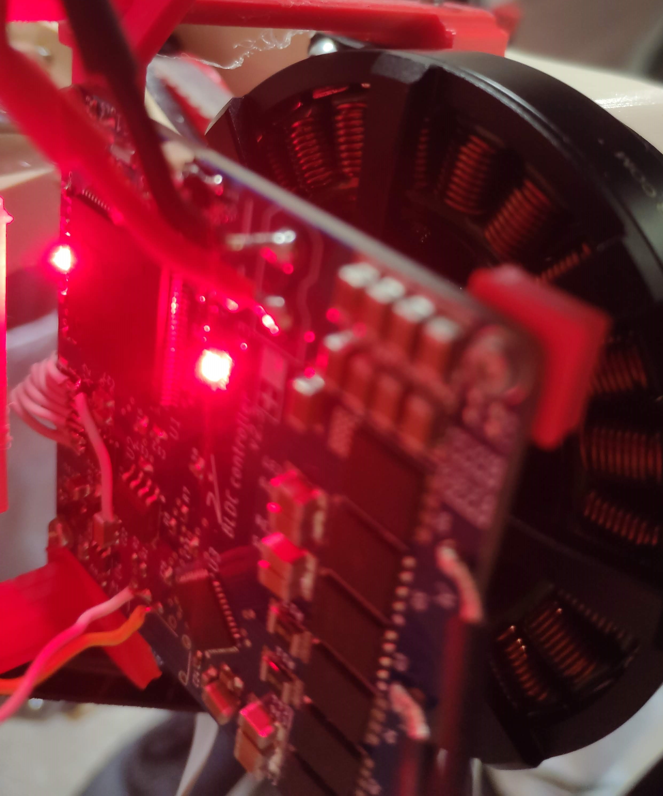

# Driver for the BLDC Controller
This is a software is used for the PCB controller based on STM32F446:

## Credits

It is based on the [motor controller from Ben Katz](https://github.com/bgkatz/motorcontrol)

